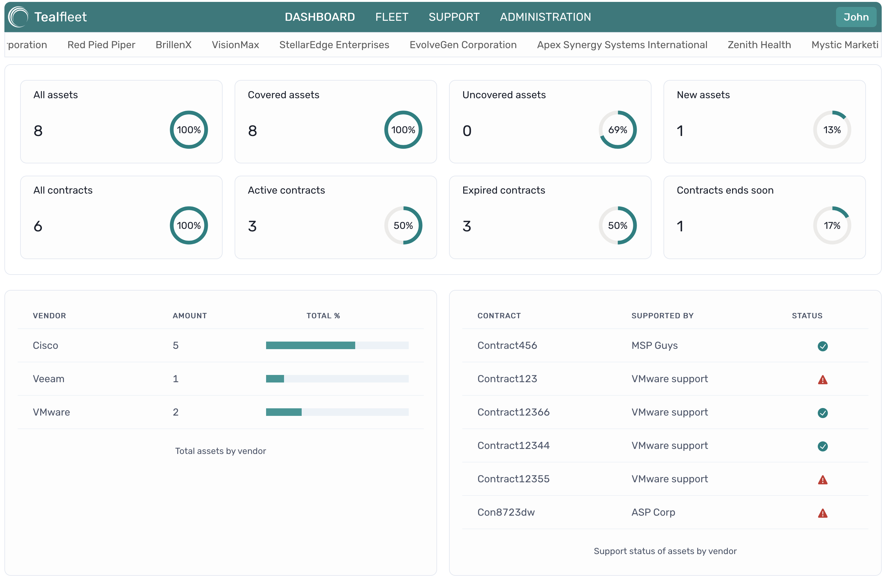
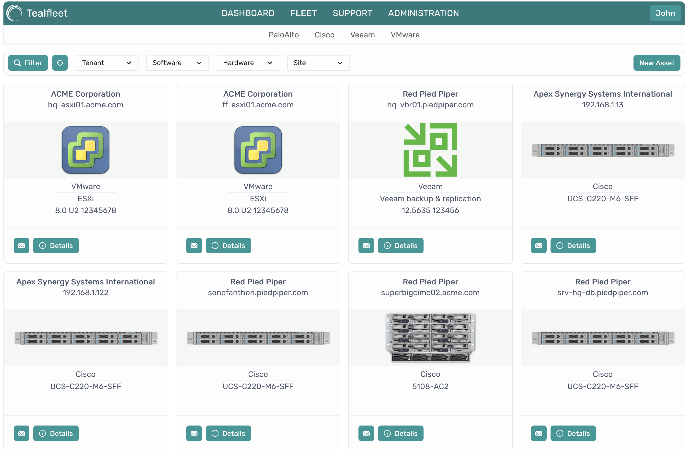
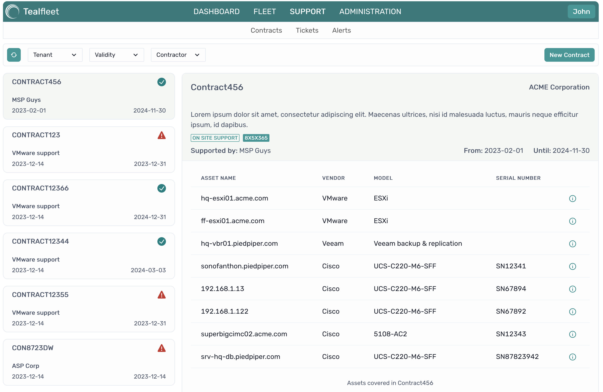

# TealFleet - Is an idea in the making.

Goal of this project is self-hosted a web app for insight into  physical and virtual assets in small to mid size data-centers.

- Compute, storage, backup servers, ...
- Switches, firewalls, load-balancers, ...
- OS, Hypervisors, backup software , ..
- Virtual and physical appliances

It will offer users an interface designed for simplicity, ensuring easy navigation, clear visibility, and a well-structured presentation of assets. This includes providing a comprehensive overview of assets along with their relevant information, such as:

- Vendor name
- Product part number and serial number
- Software versions related to that products
- Release date, end of life, end of support
- Support contracts information
- Etc…

## Screenshots from the dev version of the app

### **Dashboard**

### **Fleet overview**  
  

### **Support/contracts overview**  
 

The 'Cards' design would serve as the primary means to display this information.

# Tech Stack

## Frontend
- React
- ChakraUI
- Vite

## Backend

- NodeJS
- ExpressJS
- Database will be PostgreSQL

# So far I have done:

- Detailed GUI wire-framing for main parts of the app made with Figma
- initial database scheme design.
 [DB Scheme](https://dbdiagram.io/d/647a60ab722eb774944ed5ea).
 - Started with implementation.